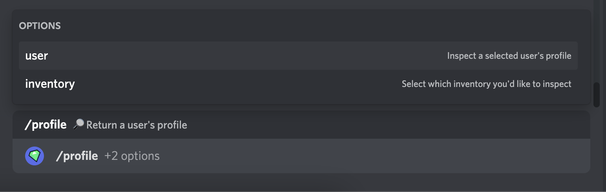

# Profile

## Grid

After executing **/profile** in your guild chat, you will be presented with a 6x6 grid. This grid holds all your [items](http://localhost:3000/docs/items) organized from left to right and top to down. Above the grid you have two quantities, your total [coins](http://localhost:3000/docs/coins) and total [gems](http://localhost:3000/docs/gems). Various items will generate you [coins](http://localhost:3000/docs/coins), which you can use to spend on perks and general goods to upgrade your profile.

## Storage

Similarly **/storage** will always return your or another user's storage. Storage serves a similar purpose to your Profile, however is purely only for storage, hence the name. Any item effects
will not persist (e.g. items that earn you [coins](http://localhost:3000/docs/coins) will not take effect in this inventory type). You may move items from your storage to profile at any time with [/move](http://localhost:3000/docs/move) and vice-versa.

## Options

| Option    | Value              | Required | Description                              |
| --------- | ------------------ | -------- | ---------------------------------------- |
| User      | User               | No       | Returns the profile of the selected user |
| Inventory | Storage or Profile | No       | Returns the selected inventory           |
