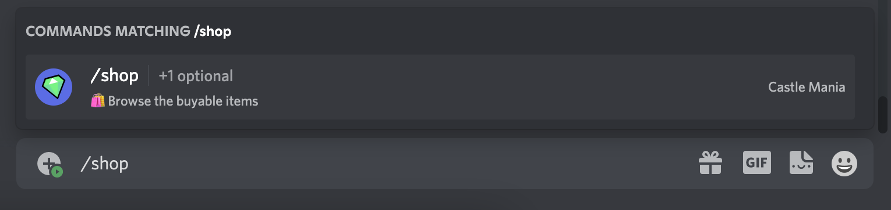

# Shop

The shop is where you can exchange your [coins](http://localhost:3000/docs/coins) for items, it'll list all the available items you can buy below the embed. It's also worth mentioning that the shop is subject to change depdending on the season.

## Buying

Every user starts with **3 Coins**, to buy an item you must type [/buy](http://localhost:3000/docs/buy) followed by the desired item you wish to purchase, optionally you can also define a quantity. Buying will only **succeed** if you have sufficient amount of [coins](http://localhost:3000/docs/coins) and slots in your inventory.

**Recommended:** `/buy basic 3`

#### Options

| Option | Value  | Required | Description                                       |
| ------ | ------ | -------- | ------------------------------------------------- |
| Item   | Item   | Yes      | Will attempt to buy the item specified            |
| Amount | Number | No       | You can also specify a quantity you'd like to buy |

## Selling

Almost identical to buying, selling will do the oposite. to sell an item you must type [/sell](http://localhost:3000/docs/sell) followed by the desired item you wish to sell. Keep in mind you **must** own the item you're trying to sell otherwise it won't work.

#### Options

| Option | Value  | Required | Description                                        |
| ------ | ------ | -------- | -------------------------------------------------- |
| Item   | Item   | Yes      | Will attempt to sell the item specified            |
| Amount | Number | No       | You can also specify a quantity you'd like to sell |

## Congratulations

You now know the basics of **Castle Mania**!
More docummentation coming soon...
